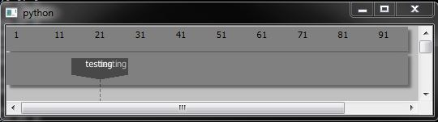

# QTimelineTags
Widgets for timeline-driven workflow using symbolic tags, actions, cues

Rough snapshot of early progress...



The demo is run from a simple test program:

```python
    app = QtGui.QApplication(sys.argv)
    g = FrameTimeline()
    g.add_tag("testing", 23)
    g.build()

    class DemoView(QtGui.QGraphicsView):

        def __init__(self, parent=None):
            super(DemoView, self).__init__(parent)
            self.setSceneRect(0, 0, 600, 400)

        def wheelEvent(self, event):
            delta = float(event.delta()) / 120.0
            g.screen_units_per_frame += delta
            g.screen_units_per_frame = max(1, g.screen_units_per_frame)
            frm = g.frame_under_mouse(event.x(), event.y())
            g.update_positions(center_on=frm)

    w = DemoView()
    w.setScene(g)

    w.show()
```
